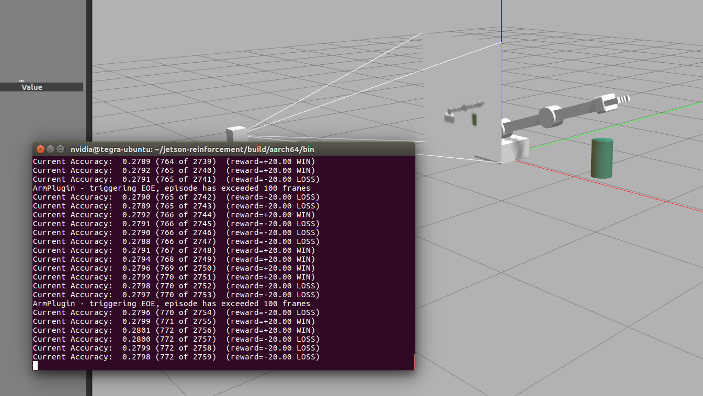

# RoboND-DeepRL-Project-Solution


This is a solution of the [Deep RL Arm Manipulation](https://github.com/udacity/RoboND-DeepRL-Project) project as part of the Robotics Nanodegree. This project is based on the Nvidia open source project [dusty-nv/jetson-reinforcement](https://github.com/dusty-nv/jetson-reinforcement) by Dustin Franklin.

A Deep Q-Network learns to control a robot arm in a simulated Gazebo environment. The robot arm is given the task of touching a target object.
1. Have any part of the robot arm touch the object of interest, with at least a 90% accuracy.
2. Have only the gripper base of the robot arm touch the object, with at least a 80% accuracy.

The project goal is to optimize the performance of this reinforcement learning agent by creating and shaping a reward function and tuning the hyperparameters of the DQN.

The solution is implemented in the file [`ArmPlugin.cpp`](gazebo/ArmPlugin.cpp), which is meant to replace the corresponding file in the  [dusty-nv/jetson-reinforcement](https://github.com/dusty-nv/jetson-reinforcement) repository.

The solution is documented in the [writeup report](writeup/writeup_deep_rl.pdf), which contains a discussion of the implemented reward functions and hyperparameter configurations as well as experimental results.

## Setup
### Jetson TX2
1. Follow the setup instructions given in [jetson-reinforcement](https://github.com/dusty-nv/jetson-reinforcement).
2. Replace the file `jetson-reinforcement/gazebo/ArmPlugin.cpp` with [`ArmPlugin.cpp`](gazebo/ArmPlugin.cpp) and the file `jetson-reinforcement/gazebo/gazebo-arm.world` with [`gazebo-arm.world`](gazebo/gazebo-arm.world). [This bash script](utils/copyFilesToJetsonReinforcement.sh) automates copying the files.
3. Change working directory to the `build` folder and `make` the project.
### RoboND Workspace
1. Follow the setup instructions given in the [Deep RL Arm Manipulation](https://github.com/udacity/RoboND-DeepRL-Project) project.
2. Replace the file `RoboND-DeepRL-Project/gazebo/ArmPlugin.cpp` with [`ArmPlugin.cpp`](gazebo/ArmPlugin.cpp) and the file `RoboND-DeepRL-Project/gazebo/gazebo-arm.world` with [`gazebo-arm.world`](gazebo/gazebo-arm.world).
3. Change working directory to the `build` folder and `make` the project.

## Usage
1. Change working directory to the `bin` folder.
2. Run the script `./gazebo-arm.sh`.
### Jetson TX2
``` bash
$ cd /home/nvidia/jetson-reinforcement/build/aarch64/bin
$ ./gazebo-arm.sh
```
### RoboND Workspace
``` bash
$ cd /home/workspace/RoboND-DeepRL-Project/build/x86_64/bin
$ ./gazebo-arm.sh
```

This launches Gazebo and and starts the DQN training loop. After each episode, the current accuracy of the agent is printed to the console.

## Configuration
The project can be configured to alter the capabilities of the robot arm and the difficulty of the RL task. 

- The control of the arm's joints can be velocity or position based.
- The arm can be configured to rotate abouts its base.
- The target object can be spawned at a user defined position or a random position within the arm's reach.
- Define which link is checked for collision with the target object.

In order to modify the behaviour of the robot arm and the prop models, the code in `ArmPlugin.cpp`, `PropPlugin.cpp`, and `gazebo-arm.world` must be adjusted.

### Challenge for Project Submission
- The arm can not rotate about its base.
  - In `ArmPlugin.cpp`, the parameter `LOCKBASE` is set to `true`.
  - In `gazebo-arm.world`, the tube model's pose is set to `<pose>1.15 0 0 0 0 0</pose>`.
- The position of the tube is not randomized.
  - In `ArmPlugin::updateJoints()`, the function `ResetPropDynamics()` is called.
### Additional Challenge
- The arm can rotate about its base.
  - In `ArmPlugin.cpp`, the parameter `LOCKBASE` is set to `false`.
  - In `gazebo-arm.world`, the tube model's pose is set to `<pose>0.75 0.75 0 0 0 0</pose>`.
- The position of the tube is randomized.
  - In `ArmPlugin::updateJoints()`, the function `RandomizeProps()` is called.
  - In `PropPlugin::Randomize()`, the position of the tube is set according to
  ```
  pose.pos.x = randf(0.35f, 0.45f);
  pose.pos.y = randf(-1.5f, 0.2f);
  pose.pos.z = 0.0f;
  ```

The project is configured with arm rotation enabled, and the target object is spawned at a random position.

## Performance
With the current project configuration, the accuracy of the agent is about 20% on the additional challenge. Approaches to improve the performance are discussed in the writeup.


