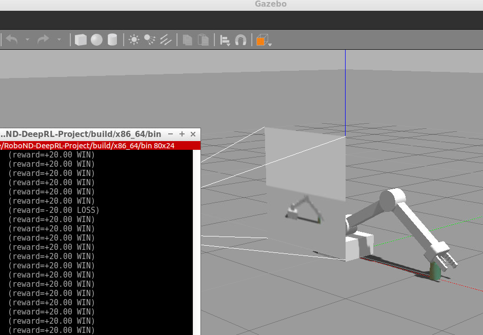

# RoboND-DeepRL-Project-Solution



This is a solution of the [Deep RL Arm Manipulation](https://github.com/udacity/RoboND-DeepRL-Project) project as part of the Robotics Nanodegree. This project is based on the Nvidia open source project [dusty-nv/jetson-reinforcement](https://github.com/dusty-nv/jetson-reinforcement) by Dustin Franklin.

A Deep Q-Network learns to control a robot arm in a simulated Gazebo environment. The robot arm is given the task of touching a target object.
1. Have any part of the robot arm touch the object of interest, with at least a 90% accuracy.
2. Have only the gripper base of the robot arm touch the object, with at least a 80% accuracy.

The project goal is to optimize the performance of this reinforcement learning agent by creating and shaping a reward function and tuning the hyperparameters of the DQN.

The solution is implemented in the file [`ArmPlugin.cpp`](gazebo/ArmPlugin.cpp), which is meant to replace the corresponding file in the  [dusty-nv/jetson-reinforcement](https://github.com/dusty-nv/jetson-reinforcement) repository.

The solution is documented in the [writeup report](writeup/writeup_deep_rl.pdf), which contains a discussion of the implemented reward functions and hyperparameter configurations as well as experimental results.

## Setup and Usage

### Jetson TX2
1. Follow the instructions given in [dusty-nv/jetson-reinforcement](https://github.com/dusty-nv/jetson-reinforcement).
2. Replace the file `jetson-reinforcement/gazebo/ArmPlugin.cpp` with [`ArmPlugin.cpp`](gazebo/ArmPlugin.cpp).
3. Change working directory to the `build` folder and `make` the project.
4. Change working directory to the `bin` folder and launch the script `./gazebo-arm.sh`. This starts Gazebo and runs the training script.

### On the RoboND workspace
This project runs on Ubuntu Linux with Gazebo installed. Follow the instructions in the [Deep RL Arm Manipulation](https://github.com/udacity/RoboND-DeepRL-Project) project.

To launch the project environment in the VM, change directory to `bin` and run the script `gazebo-arm.sh`. 

``` bash
$ cd /home/workspace/RoboND-DeepRL-Project/build/x86_64/bin
$ ./gazebo-arm.sh
```
This starts Gazebo and runs the training script.

